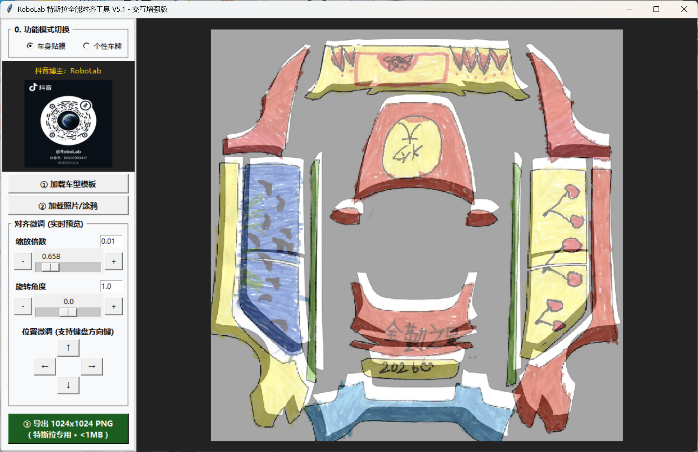

  

  # RoboLab Tesla Aligner V5.1 (特斯拉全能对齐工具)

  
  
  

  

    <b>专为特斯拉车主打造的“零门槛”涂装辅助神器</b> 
    让每一台特斯拉都独一无二
  

---

**RoboLab 特斯拉全能对齐工具** 是一款专为解决特斯拉车机自定义皮肤“对不齐、不识别、格式错”痛点而生的工具。它能将任何来源的图片，通过简单的手动微调，精准转化为符合特斯拉车机官方硬件标准（1024px / PNG / <1MB）的皮肤文件。

---

## 🚀 核心功能

* **✅ 全能素材适配**：支持手绘涂鸦、AI 生成图、手机街拍照片、网页素材，甚至是他人分享的现成皮肤包。
* **✅ 解决四大“不识别”**：一键解决素材 **尺寸不对、分辨率不达标、文件名错乱、图片格式不支持** 等导致的“车机无法读取”难题。
* **✅ 辅助精准对齐**：支持手动缩放、移动素材，确保设计完美适配官方建模底图，消除黑边与畸变。
* **✅ 强制官方规范导出**：
    * **分辨率**：自动重采样至官方最佳标准 (1024x1024)。
    * **格式**：强制转换为标准 **PNG**。
    * **体积**：深度压缩，确保单张文件 **< 1MB**。
    * **命名**：自动执行官方合规命名规范，即导即用。
* **✅ 双模式切换**：支持 **【车身个性贴膜】** 与 **【个性车牌定制】** 双模式。
* **✅ 内置全系资源**：已集成 Model 3 / Y / S / X 全车型及各地区车牌标准底图。

---

## 🛠️ 使用说明

1. **导入**：运行程序，拖入任何你喜欢的图片（JPG/PNG）。
2. **对齐**：使用鼠标微调位置和大小，使其与软件内置的车型模板重合。
3. **导出**：点击一键生成，软件将自动处理所有格式、体积、命名问题。
4. **加载**：将生成的文件夹拷贝至 U 盘指定路径，插入特斯拉即可在车机端预览。

---

## ⚠️ 重要运行说明 (必读)

### 关于杀毒软件误报
由于本工具为 **绿色免安装版** (由 PyInstaller 封装)，目前尚未购买昂贵的数字签名。
* **现象**：运行前，**360安全卫士、腾讯电脑管家或 Windows Defender** 可能会拦截并提示“未知风险”。
* **对策**：运行前请 **暂时关闭杀毒软件**，或在弹窗时选择 **“允许运行/添加信任”**。
* **建议**：本软件纯净无毒，仅用于图片处理。如仍有顾虑，建议在 Windows 沙盒或虚拟机环境下运行。

---

## ⚖️ 免责声明

在使用本工具前，请务必阅读并同意以下条款：

1. **非官方关联**：本工具为独立开发者制作的第三方辅助工具，与 **特斯拉（Tesla Inc.）** 官方及其关联公司无任何行政或商业关联。
2. **使用风险自担**：本软件仅提供图片处理功能。开发者已尽力确保程序的稳定性，但不对于使用过程中可能产生的任何硬件损坏、系统异常、数据丢失或车辆质保相关问题承担法律责任。
3. **禁止商用**：本工具仅供个人学习与技术交流使用，**严禁用于任何形式的商业售卖**。

---

## 📺 视频教程

* [车身涂装篇 (抖音演示)](https://www.douyin.com/user/self?from_tab_name=main&modal_id=7592391709569924731)
* [个性车牌篇 (抖音演示)](https://www.douyin.com/user/self?modal_id=7593190722300601777)

---

### 💡 开发者说
这个工具的初衷就是为了让每一个车主都能零门槛定制自己的座驾。如果你觉得好用，请给这个项目点一个 **Star ⭐**，这是我持续更新的动力！